# Crowdfunding Back End
Shannon Lowe

## Planning:
### Concept/Name
My Shot Fund
(I am not throwin' away my shot
Ayo, I'm just like my country
I'm young, scrappy and hungry
And I'm not throwin' away my shot)

A fundraising program that you can only use once. What is the one thing you need to get your life together?
A new office chair? A plane ticket to get away? A new Mattress? A gym membership for a year?
Each idea would have to be verified manually before being allowed.

### Intended Audience/User Stories
People who just need a one chance to change their daily lives in a simple way

### Front End Pages/Functionality
- {{ A page on the front end }}
    - {{ A list of dot-points showing functionality is available on this page }}
    - {{ etc }}
    - {{ etc }}
- {{ A second page available on the front end }}
    - {{ Another list of dot-points showing functionality }}
    - {{ etc }}

### API Spec

| URL                  | HTTP Method | Purpose                                  | Request Body                                       | Success Response Code | Authentication |
| -------------------- | ----------- | ---------------------------------------- | -------------------------------------------------- | --------------------- | -------------- |
| `/users/`            | POST        | Create a new user account                | `username`, `email`, `password`                    | 201 Created           | None           |
| `/users/`            | GET         | Get all users                            | None                                               | 200 OK                | None           |
| `/users/<id>/`       | GET         | Get a specific user                      | None                                               | 200 OK                | None           |
| `/api-token-auth/`   | POST        | Obtain auth token + user details         | `username`, `password`                             | 200 OK                | None           |
| `/fundraisers/`      | GET         | Get all fundraisers                      | None                                               | 200 OK                | None           |
| `/fundraisers/`      | POST        | Create a new fundraiser                  | `title`, `description`, `goal`, `image`, `is_open` | 201 Created           | Token          |
| `/fundraisers/<id>/` | GET         | Get fundraiser detail (includes pledges) | None                                               | 200 OK                | None           |
| `/fundraisers/<id>/` | PATCH       | Update fundraiser (owner or admin)       | Any fundraiser fields (partial)                    | 200 OK                | Token          |
| `/fundraisers/<id>/` | DELETE      | Delete fundraiser (owner or admin)       | None                                               | 204 No Content        | Token          |
| `/pledges/`          | GET         | Get all pledges                          | None                                               | 200 OK                | None           |
| `/pledges/`          | POST        | Create a pledge                          | `amount`, `comment`, `anonymous`, `fundraiser`     | 201 Created           | Token          |
| `/pledges/<id>/`     | DELETE      | Delete a pledge (supporter only)         | None                                               | 204 No Content        | Token          |


### DB Schema

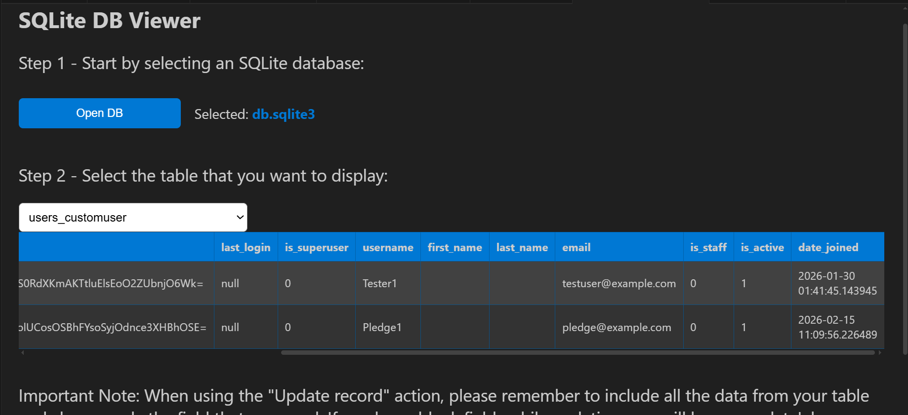
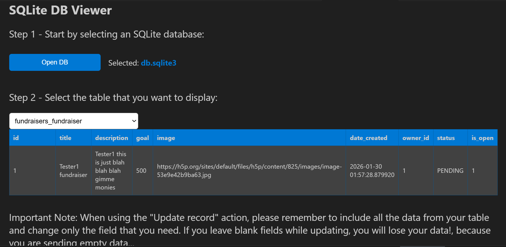

## API Testing Evidence

Below is proof that each endpoint works correctly, including authentication, permissions, and business rules.


### Create User – 201 Created

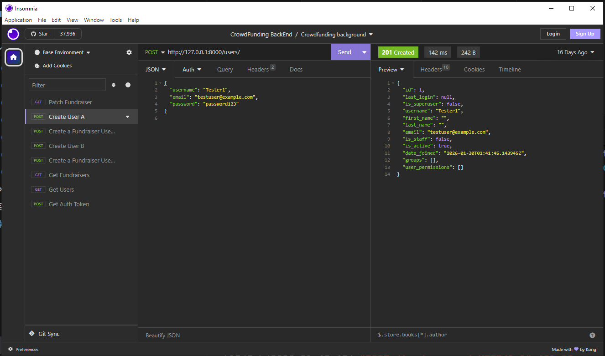


### Get All Fundraisers – 200 OK

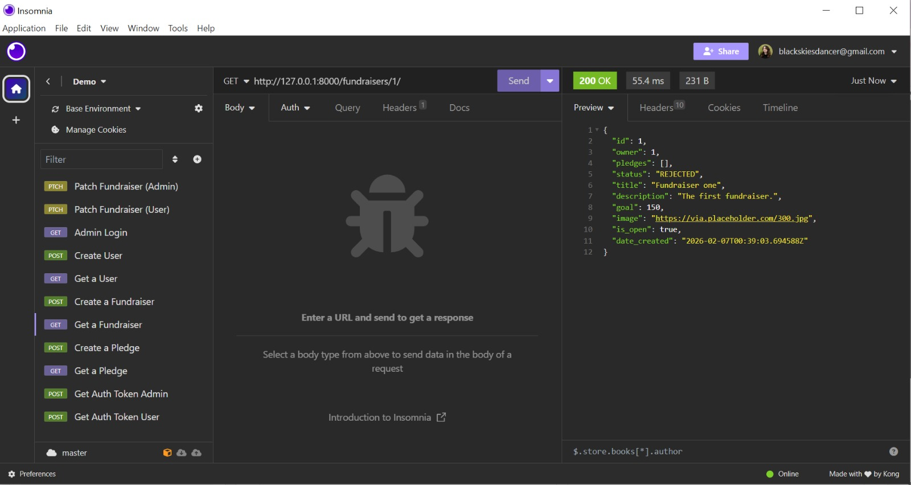


### Create Fundraiser (Without Token) – 401 Unauthorized

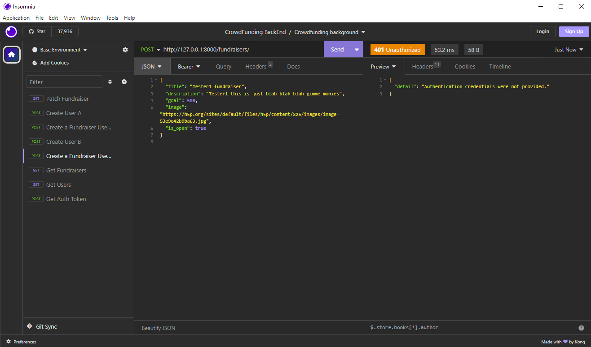


### Create Fundraiser (Success) – 201 Created

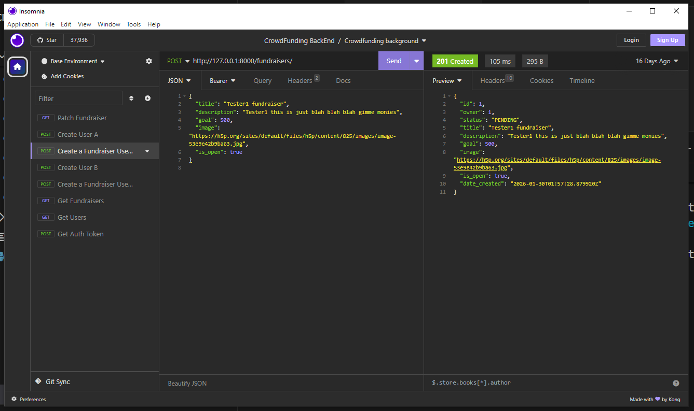


### Business Rule – Only One Pending/Approved Fundraiser – 400 Bad Request

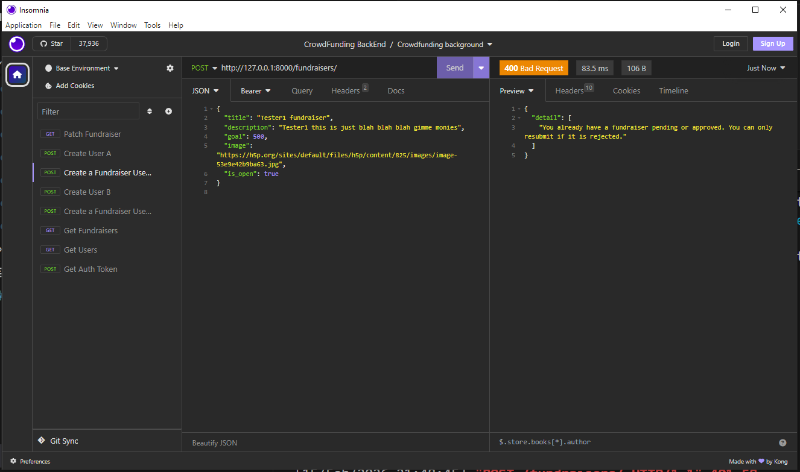


### Patch Fundraiser (Admin) – 200 OK

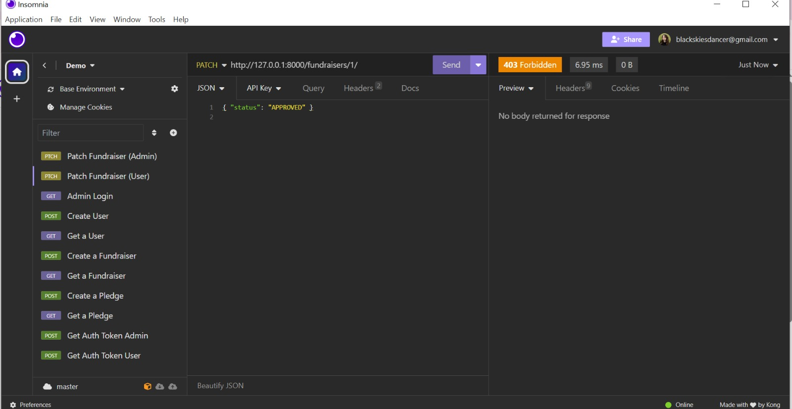


### Patch Fundraiser (User Forbidden) – 403 Forbidden

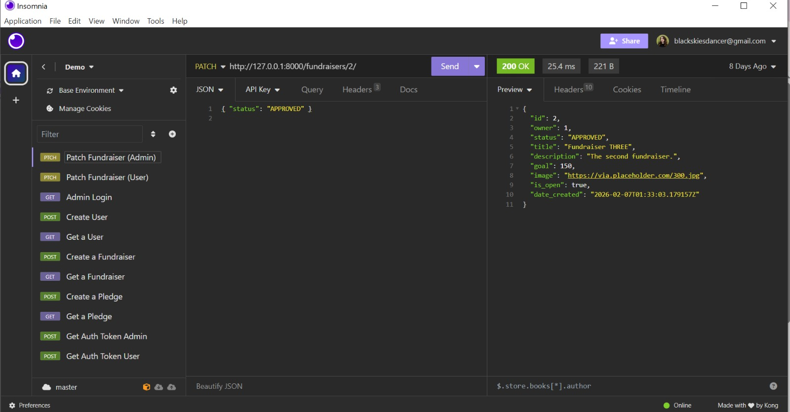


### Create Pledge – 201 Created

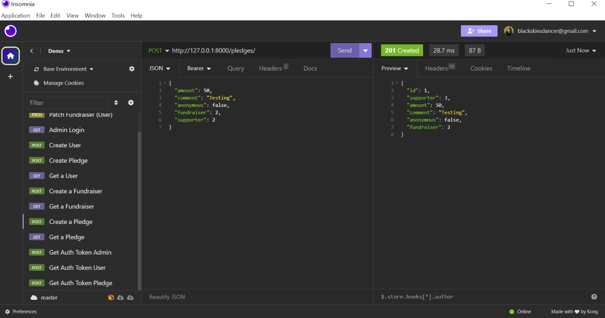


### Pledge Rejected – Fundraiser Closed – 400 Bad Request

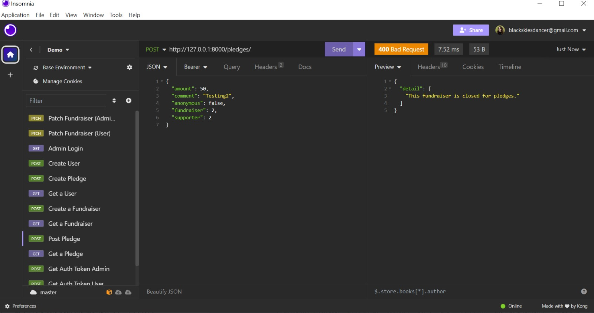


### Pledge Rejected – Fundraiser Not Approved – 400 Bad Request

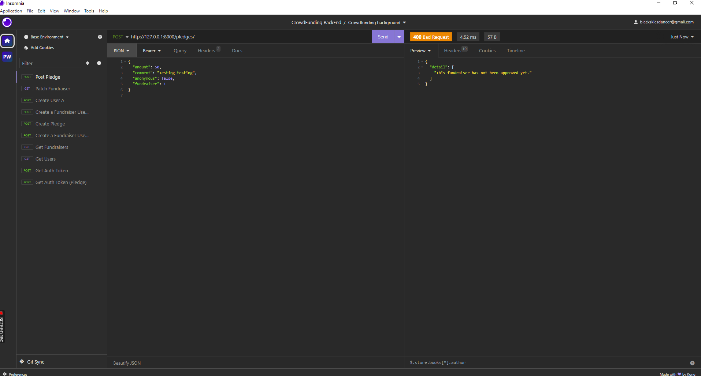


### Obtain Authentication Token – 200 OK

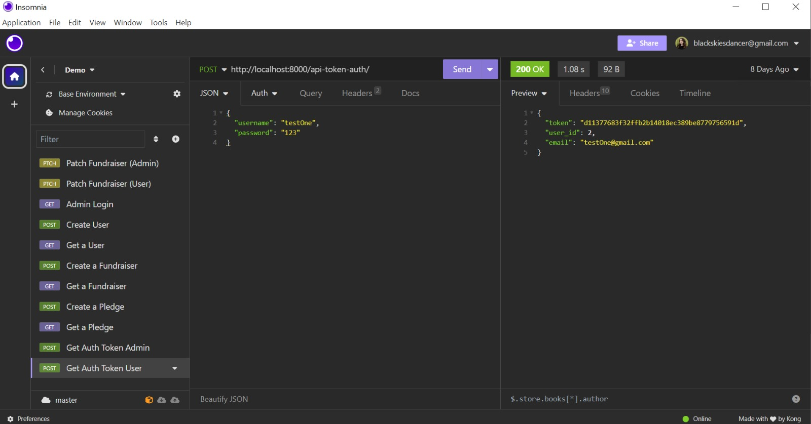


### Backend API
https://crowdfunding-ijustneedonething-06a0f674c900.herokuapp.com/


###  How to Register a New User + Create a Fundraiser (Step-by-step)

> Base URL (local): `http://127.0.0.1:8000`

#### 1 Register a new user
**Endpoint:** `POST /users/`  
**Auth:** None  
**Body (JSON):**
```json
{
  "username": "Tester1",
  "email": "testuser@example.com",
  "password": "password123"
}
```

#### 2 Obtain an Authentication Token
**Endpoint:** `POST /api-token-auth/`  
**Auth:** None
**Body (JSON):**
```json
{
  "username": "Tester1",
  "password": "_ENTER_USERPASS"
}
```

#### 3 Create a New Fundraiser
**Endpoint:** `POST /fundraisers/`  
**Auth:** Token (Bearer)
**Body (JSON):**
```json

{
  "title": "Tester1 fundraiser",
  "description": "Tester1 this is just blah blah blah gimme monies",
  "goal": 500,
  "image": "https://h5p.org/sites/default/files/h5p/content/825/images/image-53e9e42b9ba63.jpg",
  "is_open": true
}
```